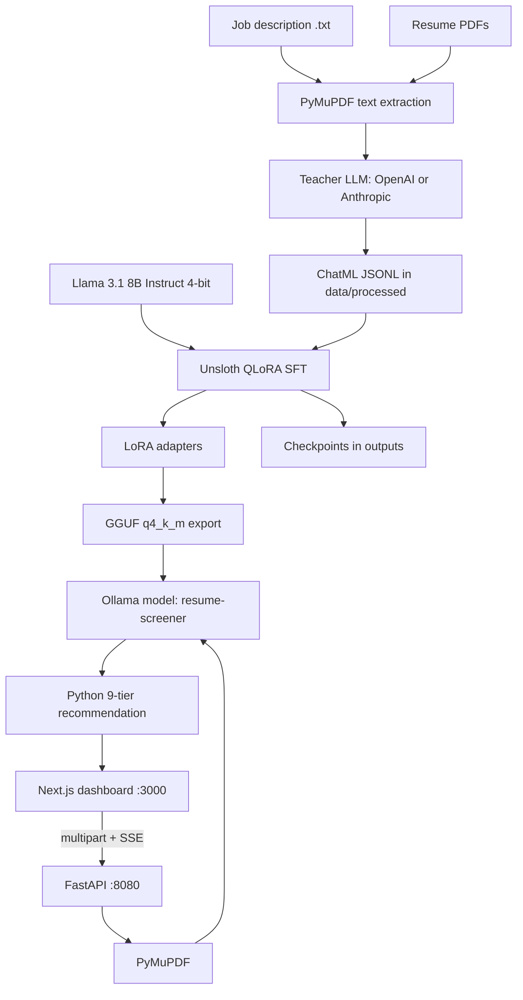

# 📄 AI Resume Screener

A local applicant-tracking screener that scores resumes against a job description on a 6GB GPU. A teacher model labels sample resumes, Unsloth QLoRA fine-tunes Llama 3.1 8B, and the resulting 4-bit GGUF is served with Ollama. FastAPI parses PDFs and streams results to a Next.js dashboard. Recommendation tiers are computed in Python from the numeric score, not guessed by the model at serving time.

Screening is strictly sequential. One resume is scored at a time so the GPU is never asked to run two generations at once.

---

## 1. System Architecture

Training and serving are separate stages. The dashboard never loads PyTorch. It talks to FastAPI, and FastAPI talks to Ollama.



| Stage | What it does | Where it lives |
| :--- | :--- | :--- |
| **Preprocess** | Builds a sample job description and synthetic resume PDFs, then extracts text locally. | `src/data_prep/`, `src/backend/parser.py` |
| **Teaching** | Asks a cloud teacher model to score each resume and writes ChatML training rows. | `src/data_prep/generate_dataset.py` |
| **Fine-tuning** | QLoRA-tunes Llama 3.1 8B in 4-bit on the JSONL file. | `src/training/train_qlora.py` |
| **Export** | Merges the adapter and writes a `q4_k_m` GGUF. | `src/training/export_gguf.py` |
| **Serving** | Registers that GGUF in Ollama as `resume-screener`. | `exported_models_gguf/Modelfile` |
| **API** | Parses uploads, calls Ollama one resume at a time, maps the score to an HR tier, streams SSE. | `src/backend/` |
| **Frontend** | Job description, resume list, live progress, ranked results. | `frontend/` |

---

## 2. Tech Stack & Justifications

| Layer | Technology | Why |
| :--- | :--- | :--- |
| **Student model** | **Llama 3.1 8B Instruct, 4-bit** (`unsloth/Meta-Llama-3.1-8B-Instruct-bnb-4bit`) | Fits a 6GB GPU and follows instructions well enough to emit JSON. The Unsloth build avoids a gated Hugging Face repo. |
| **Fine-tuning** | **Unsloth + QLoRA + TRL SFT** | Full fine-tuning does not fit this machine. 4-bit base weights, LoRA rank 8, batch size 1, and gradient checkpointing do. |
| **Teacher labels** | **OpenAI or Anthropic via Instructor** | Bootstrap a small structured dataset without hand-labeling every resume. The provider and model id come from `.env`. |
| **PDF parsing** | **PyMuPDF** (`fitz`) | Local text extraction. No cloud OCR. |
| **Quantized serving** | **Ollama + GGUF `q4_k_m`** | Runs the fine-tuned model on 6GB VRAM through an OpenAI-compatible API at `http://localhost:11434/v1`. |
| **Backend** | **FastAPI + Uvicorn** | Multipart uploads, automatic OpenAPI docs, and server-sent events for per-candidate progress. |
| **Schema** | **Pydantic** | Rejects malformed model JSON before it reaches the UI. |
| **Frontend** | **Next.js 15 + React 19 + Tailwind** | Single-page recruiter dashboard on port 3000. |
| **Python env** | **uv** | App dependencies live in `pyproject.toml`. Training uses a separate CUDA environment. |
| **Secrets** | **python-dotenv** | Model ids and API keys are read from `.env`. Nothing is hardcoded. |

Two Python environments on purpose:

- **App environment** (`.venv`, created by `uv`): FastAPI, PDF parsing, and the OpenAI client that calls Ollama. This is all you need to run the product after the GGUF exists.
- **Training environment** (CUDA PyTorch + Unsloth): fine-tuning, GGUF export, and direct adapter inference. The scripts call this `finetuning_env` in their error text. Do not install Unsloth into the small app venv, and do not run training while Ollama is holding the GPU.

---

## 3. Screening Schema

Every training label is strict JSON. The served model returns the same judgment fields, plus a candidate name and a one-line summary. The API adds `recommendation` itself.

| Key | Type | Who sets it |
| :--- | :--- | :--- |
| `score` | integer 0–100 | Teacher (training) or local LLM (serving) |
| `confidence_level` | `"High"`, `"Medium"`, or `"Low"` | Model |
| `flag_for_human` | boolean | Model. True when the case is ambiguous, incomplete, or borderline. |
| `strengths` | string | Model |
| `weaknesses` | string | Model |
| `recommendation` | one of the 9 tiers below | Teacher label during training. **Python** at serving time. |
| `candidate_name` | string | Serving only. Falls back to the filename. |
| `quick_summary` | string | Serving only. One sentence for the results table. |

Recommendation tiers, applied from `score` in `src/backend/recommend.py`:

| Score | Recommendation |
| :--- | :--- |
| 95–100 | Strong Shortlist |
| 85–94 | Shortlist |
| 75–84 | Interview Recommended |
| 65–74 | Consider |
| 55–64 | Borderline |
| 45–54 | Hold |
| 35–44 | Upskill & Reapply |
| 20–34 | Alternative Role Recommended |
| 0–19 | Reject |

Training rows are ChatML. One resume becomes one line in `data/processed/resume_training_data.jsonl`:

```json
{
  "messages": [
    {"role": "system", "content": "You are an expert technical recruiter..."},
    {"role": "user", "content": "Job description + extracted resume text"},
    {"role": "assistant", "content": "{\"score\": 88, \"confidence_level\": \"High\", \"flag_for_human\": false, \"strengths\": \"...\", \"weaknesses\": \"...\", \"recommendation\": \"Shortlist\"}"}
  ]
}
```

---

## 4. Repository Layout

```text
.
├── src/data_prep/          # sample PDFs, teacher labeling
│   ├── setup_sample_data.py
│   ├── generate_dataset.py
│   └── generate_pdfs.py
├── src/training/
│   ├── train_qlora.py      # QLoRA SFT
│   └── export_gguf.py      # merge adapter -> q4_k_m GGUF
├── src/inference/
│   └── screen_resume.py    # score with the adapter directly (no Ollama)
├── src/backend/            # FastAPI ATS
├── frontend/               # Next.js dashboard
├── data/job_descriptions/  # JD text files
├── data/raw_resumes/       # PDFs used to build the training set
├── data/test_data/         # labeled fixtures for the dashboard
├── data/processed/         # JSONL datasets and inference dumps (gitignored)
├── adapters/               # saved LoRA weights (gitignored)
├── outputs/                # trainer checkpoints (gitignored)
├── exported_models_gguf/   # GGUF + Ollama Modelfile (gitignored)
├── .env.example
└── pyproject.toml
```

Weights, checkpoints, generated JSONL, and `.env` are gitignored. A fresh clone has the code and sample inputs, not the fine-tuned model.

---

## 5. Prerequisites

- **Windows** with an **NVIDIA GPU**. The training script is tuned for an RTX 3060 Laptop (6GB VRAM) and 16GB system RAM. A larger GPU works. CPU-only training will not.
- **Python 3.12+** and **[uv](https://docs.astral.sh/uv/)**
- **Node.js 18+**
- **Ollama** for serving
- **A CUDA PyTorch + Unsloth environment** for sections 6.C–6.D and section 8. Follow the current [Unsloth install guide](https://docs.unsloth.ai/get-started/installing-+-updating) for your CUDA version. The scripts import `unsloth`, `trl`, `datasets`, and CUDA `torch`.
- **An OpenAI or Anthropic API key**, only for the teacher step that builds the training set

```powershell
git clone <your-repo-url>
cd ai-resume-screener
copy .env.example .env
```

Edit `.env` before the teacher step. At minimum set `OPENAI_API_KEY` or `ANTHROPIC_API_KEY`. Leave the `LLM_*` values pointed at local Ollama. Never commit `.env`.

Install the app environment once:

```powershell
uv sync
uv add reportlab instructor anthropic
```

`uv sync` installs FastAPI, Uvicorn, PyMuPDF, Pydantic, and the OpenAI client. The extra three packages are only needed to generate sample PDFs and call the teacher.

---

## 6. Pipeline: From Resumes to a Local Model

Run this once to produce the model. Skip to [section 7](#7-run-the-application) if `exported_models_gguf` already contains the GGUF and `ollama list` shows `resume-screener`.

### A. Preprocess — sample job description and resumes

`setup_sample_data.py` writes a Senior Python / AI Engineer job description and five synthetic resumes with different levels of fit.

```powershell
uv run python src/data_prep/setup_sample_data.py
```

Outputs:

- `data/job_descriptions/sample_jd.txt`
- `data/raw_resumes/*.pdf` (five candidates)

Text is extracted later with PyMuPDF. No OCR service is involved.

The dashboard also has hand-labeled fixtures already in the repo, used to try the UI rather than to train:

- `data/test_data/Job_description.txt`
- `data/test_data/Alex_Chen_Strong_Shortlist.pdf`
- `data/test_data/Sarah_Jenkins_Consider.pdf`
- `data/test_data/David_Miller_Reject.pdf`

Regenerate those three PDFs from the current directory you want them written into (the script saves next to the working directory):

```powershell
cd data\test_data
uv run python ..\..\src\data_prep\generate_pdfs.py
cd ..\..
```

Drop your own PDFs into `data/raw_resumes/` and replace `sample_jd.txt` if you want the teacher to label a different role. Keep resumes as text-based PDFs. Scanned images will extract as empty text and be skipped.

### B. Teaching — label the dataset with a cloud model

`generate_dataset.py` reads the job description and every PDF in `data/raw_resumes/`, calls the teacher with a Pydantic schema, forces `recommendation` onto the score band, and rewrites the JSONL file from scratch.

```powershell
uv run python src/data_prep/generate_dataset.py
```

What the script prints per resume: score, recommendation, confidence, and `flag_for_human`.

Output: `data/processed/resume_training_data.jsonl`.

Teacher selection comes only from `.env`:

| Variable | Role |
| :--- | :--- |
| `TEACHER_PROVIDER` | `openai`, `anthropic`, or `auto` (OpenAI if that key is set, otherwise Anthropic) |
| `TEACHER_MODEL_ID` | Any model that key can call. Default `gpt-4o-mini` or `claude-3-5-sonnet-latest`. |
| `OPENAI_API_KEY` / `OPENAI_BASE_URL` | OpenAI, or any OpenAI-compatible gateway |
| `ANTHROPIC_API_KEY` / `ANTHROPIC_BASE_URL` | Anthropic. Keep the base URL on `https://api.anthropic.com` unless you really have a proxy. |

Temperature is `0`. Each request retries twice. A localhost base URL is warned about, because a dead local proxy looks like an API failure.

### C. Fine-tuning — QLoRA on the 6GB GPU

Stop Ollama and anything else using the GPU. Confirm VRAM is free, then activate the CUDA Unsloth environment (not `.venv`).

```powershell
nvidia-smi
python src/training/train_qlora.py
```

The script reads `BASE_MODEL_ID` from `.env`, loads `data/processed/resume_training_data.jsonl`, and trains with these 6GB defaults:

| Setting | Value | Why |
| :--- | :--- | :--- |
| Base | `unsloth/Meta-Llama-3.1-8B-Instruct-bnb-4bit` | 4-bit weights so the 8B model loads |
| `MAX_SEQ_LENGTH` | 256 | Activations fit beside the base weights. Floor is 128. |
| LoRA rank `LORA_R` | 8 | Small adapter. All attention and MLP projections by default. |
| Batch | 1, gradient accumulation 4 | Effective batch of 4 without a real batch on 6GB |
| Steps | 60, warmup 5, lr `2e-4`, linear schedule | Short SFT run for a tiny dataset |
| Optimizer | `adamw_8bit` | Less optimizer state than fp32 Adam |
| Precision | bf16 if the GPU supports it, else fp16 | |
| Checkpointing | on, cache cleared every step | Stops the 6GB card from fragmenting |
| CE loss chunking | `UNSLOTH_CE_LOSS_TARGET_GB=0.05`, `UNSLOTH_CE_LOSS_N_CHUNKS=128` | Unsloth refuses fused loss when almost no VRAM is free after load. These env vars are set before Unsloth is imported. |

System and user turns are truncated so the chat template fits in 256 tokens. The assistant JSON is left intact.

Outputs:

- `adapters/` — LoRA weights and tokenizer. This is what export and direct inference load.
- `outputs/` — one trainer checkpoint (`save_steps=60`, `save_total_limit=1`).

If CUDA runs out of memory, close every Python process, open a new shell, and retry smaller:

```powershell
$env:MAX_SEQ_LENGTH="128"
$env:LORA_R="4"
$env:LORA_TARGETS="q_proj,v_proj"
$env:UNSLOTH_CE_LOSS_TARGET_GB="0.03"
$env:UNSLOTH_CE_LOSS_N_CHUNKS="256"
python src/training/train_qlora.py
```

`EXPORT_GGUF=1` also writes a GGUF under `adapters/gguf` at the end of training. On a 6GB card, prefer the separate export in the next step so training and export do not share one process.

### D. Export — 4-bit GGUF

Still inside the CUDA Unsloth environment, with Ollama stopped:

```powershell
$env:EXPORT_DIR="exported_models_gguf"
$env:MAX_SEQ_LENGTH="512"
python src/training/export_gguf.py
```

This loads `adapters/`, merges the LoRA into the base, and writes a `q4_k_m` GGUF into `exported_models_gguf/`. `q4_k_m` is the quantization that still fits local inference on 6GB.

`exported_models_gguf/Modelfile` already points at the file next to it:

```text
FROM Meta-Llama-3.1-8B-Instruct.Q4_K_M.gguf
```

If Unsloth names the new file differently, change that `FROM` line to the filename that was just written. Use this Modelfile, not the one in the repo root (that one contains a machine-specific absolute path).

Optional overrides: `ADAPTERS_DIR`, `EXPORT_DIR`, `MAX_SEQ_LENGTH`, `BASE_MODEL_ID` (hint only; the real base id is in `adapters/adapter_config.json`).

### E. Serve the LLM with Ollama

The model name must be exactly `resume-screener`, because that is `LLM_MODEL_ID` in `.env`.

```powershell
cd exported_models_gguf
ollama create resume-screener -f Modelfile
ollama run resume-screener
```

Leave that process running. Ollama's OpenAI-compatible endpoint is:

```text
http://localhost:11434/v1
```

Confirm the name:

```powershell
ollama list
```

You only run `ollama create` again after a new GGUF export.

---

## 7. Run the Application

Three processes, in this order: Ollama, FastAPI, Next.js. Use the `uv` app environment for the API. Training packages are not required here.

### A. FastAPI backend

From the project root, with `.env` in place:

```powershell
uv run uvicorn src.backend.main:app --host 127.0.0.1 --port 8080
```

| URL | What you should see |
| :--- | :--- |
| [http://localhost:8080/health](http://localhost:8080/health) | `{"status":"ok","service":"ats-backend"}` |
| [http://localhost:8080/api/health](http://localhost:8080/api/health) | Backend up, plus whether Ollama is reachable and whether `resume-screener` is in the model list |
| [http://localhost:8080/docs](http://localhost:8080/docs) | OpenAPI UI |

`POST /api/screen` accepts multipart form data:

- `jd_text` — pasted job description, or
- `jd_file` — a `.txt` / `.md` / PDF job description
- `resumes` — one or more resume PDFs

The handler extracts text with PyMuPDF, calls Ollama once per resume, validates the JSON, maps `score` through `get_recommendation()`, and streams server-sent events:

| Event `type` | Meaning |
| :--- | :--- |
| `progress` | `Scanning candidate X of Y...` |
| `result` | One finished candidate |
| `error` | That file failed; the queue continues |
| `done` | Queue finished |

CORS allows `FRONTEND_ORIGIN` (default `http://localhost:3000`).

### B. Frontend

```powershell
cd frontend
copy .env.local.example .env.local
npm install
npm run dev
```

From the repo root the same scripts are `npm run install:frontend` and `npm run dev`.

Open [http://localhost:3000](http://localhost:3000). The UI calls `NEXT_PUBLIC_API_URL` (default `http://localhost:8080`).

### C. Use the dashboard

1. Paste a job description, or switch to file upload. `data/test_data/Job_description.txt` is a ready example.
2. Add resume PDFs. The list lets you remove a file before you run. The three PDFs in `data/test_data/` are an easy first batch.
3. Click **Run AI Screening**. The button stays disabled until there is a job description and at least one resume.
4. Watch the progress line: `Scanning candidate 1 of 3...`. Results appear one at a time. A 6GB GPU will not score them in parallel.
5. The table ranks candidates by score. Select a row to open strengths, weaknesses, the HR tier, the human-review flag, and the raw JSON.

---

## 8. Optional: Score with the Adapter Directly

`src/inference/screen_resume.py` loads the LoRA adapter with Unsloth and scores every PDF in `data/raw_resumes/` against `sample_jd.txt`. Use this to check the adapter before you export a GGUF. It needs the CUDA environment, and it cannot run while Ollama is using the GPU.

```powershell
python src/inference/screen_resume.py
```

It prints a summary table and writes `data/processed/inference_results.jsonl`.

| Variable | Default |
| :--- | :--- |
| `ADAPTERS_DIR` | `adapters/` |
| `JD_PATH` | `data/job_descriptions/sample_jd.txt` |
| `RESUME_DIR` | `data/raw_resumes/` |
| `OUTPUT_JSONL` | `data/processed/inference_results.jsonl` |
| `MAX_SEQ_LENGTH` | 1024 |
| `MAX_NEW_TOKENS` | 256 |

If load fails, drop `MAX_SEQ_LENGTH` to `512` and free the GPU first.

---

## 9. Environment Variables

Copy `.env.example` to `.env`. The frontend has its own file.

**Project root `.env`**

```env
TEACHER_PROVIDER=openai
TEACHER_MODEL_ID=gpt-4o-mini
BASE_MODEL_ID=unsloth/Meta-Llama-3.1-8B-Instruct-bnb-4bit

OPENAI_API_KEY=your_openai_api_key_here
OPENAI_BASE_URL=https://api.openai.com/v1

ANTHROPIC_API_KEY=your_anthropic_api_key_here
ANTHROPIC_BASE_URL=https://api.anthropic.com

LLM_BASE_URL=http://localhost:11434/v1
LLM_MODEL_ID=resume-screener
LLM_API_KEY=ollama
FRONTEND_ORIGIN=http://localhost:3000
```

`LLM_API_KEY` can stay `ollama`. Ollama does not check it; the OpenAI client only requires a non-empty string.

**`frontend/.env.local`**

```env
NEXT_PUBLIC_API_URL=http://localhost:8080
```

Training and export also honor `MAX_SEQ_LENGTH`, `LORA_R`, `LORA_TARGETS`, `EXPORT_GGUF`, `ADAPTERS_DIR`, and `EXPORT_DIR`. See sections 6.C and 6.D.

---

## 10. Hardware Notes

This project targets an RTX 3060 (6GB), 16GB RAM, and a local disk. A few rules follow from that:

- Do not fine-tune, export, and serve at the same time. One of those owns the GPU.
- The API never fans out. A batch of 10 resumes is 10 Ollama calls in order.
- If `nvidia-smi` shows leftover Python processes after a crash, stop them before the next train or export.
- If `/api/health` says the LLM is unreachable, Ollama is not running, or `LLM_MODEL_ID` does not match `ollama list`.
- Empty PDF text means the file is a scan. PyMuPDF will not OCR it. Replace it with a text PDF.
